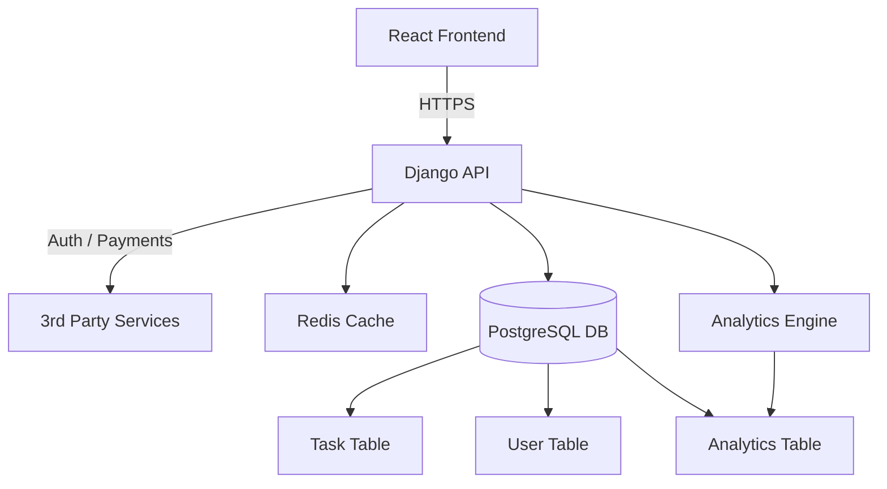
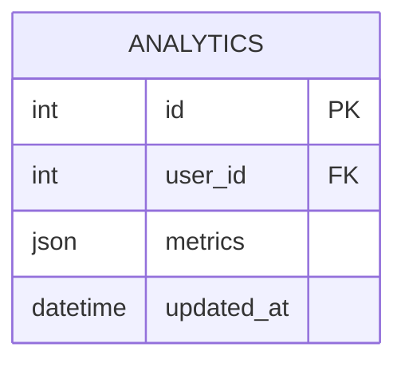

# 🛠 Productivity Dashboard – Backend Architecture

This document captures the **backend system design** for the Productivity Dashboard, based on our original sketches.

---

## 1. High-Level Architecture



## Explanation:
 - Frontend → React, communicates with the Django REST API.
 - Django API → main backend, handles business logic.
 - Redis Cache → used for sessions, caching, and background tasks.
 - PostgreSQL DB → persistent storage for users, tasks, and analytics.
 - Analytics Engine → processes user activity into insights.
 - 3rd Party Services → external auth + Stripe for payments.

## 2. User Authentication Flow
```mermaid
Copy code
sequenceDiagram
    participant Frontend
    participant Backend
    participant Stripe
    participant User

    Frontend->>Backend: POST /auth/login
    Backend->>User: Verify credentials
    User-->>Backend: Return auth status
    Backend->>Frontend: Session token / JWT

    Frontend->>Backend: POST /payment (amount, userId)
    Backend->>Stripe: Create paymentIntent
    Stripe-->>Backend: client_secret
    Backend-->>Frontend: client_secret
    Frontend->>Stripe: Confirm payment with client_secret
    Stripe-->>Backend: Payment success
    Backend-->>Frontend: Payment confirmed
```

## 3. Analytics Update Flow
```mermaid
Copy code
sequenceDiagram
    participant Scheduler
    participant Backend
    participant DB

    Scheduler->>Backend: Trigger analytics update
    Backend->>DB: Fetch task + user activity
    Backend->>DB: Update analytics tables
    DB-->>Backend: Success
```

## 4. Database Entities
### User Table
```mermaid
Copy code
erDiagram
    USER {
        int id PK
        string email
        string password
        datetime created_at
        bool is_premium
    }
```

### Task Table
```mermaid
Copy code
erDiagram
    TASK {
        int id PK
        string title
        string priority  "H | M | L"
        string status    "TODO | IN_PROGRESS | DONE"
        int user_id FK
    }
```

### Analytics Table


## 5. Key Notes
 - Django + DRF power the backend.
 - Redis for performance + async tasks.
 - Stripe for payments.
 - Analytics Engine runs scheduled jobs for productivity insights.
 - PostgreSQL holds relational data with strong typing.

## ✅ Next: Frontend workflow + integration diagrams.

```yaml
---

👉 Do you want me to also generate **PNG/SVG versions** of these diagrams so you can embed them as images in GitHub README, or should we stick with **Mermaid inside Markdown** (lighter, version-controlled)?

```

